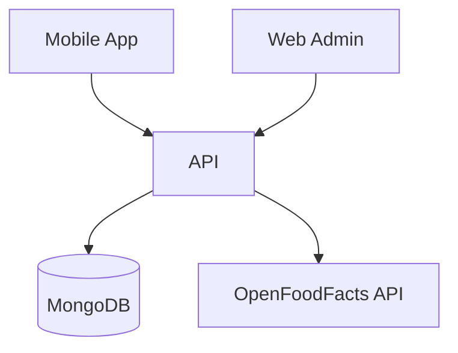

# Advanced Inventory Manager


## 🧾 Description

**Advanced Inventory Manager** is a full-featured solution to manage inventory, products, users, and billing across both web and mobile platforms. It offers a clean and responsive UI for both admins and end-users, while ensuring robust performance, secure transactions, and insightful analytics.

---

## 🚀 Features

### 🌐 Web App

- 🔐 Administrator authentication
- 📦 Product CRUD management
- 🧾 Invoice tracking & management
- 👤 User management
- 📊 Sales statistics & reports
- ⭐ Viewing and moderating product ratings/reviews

### 📱 Mobile App

- 🔓 Login (auto-reconnect) / Registration
- 📷 Barcode scanning & manual entry
- 🧃 Product detail display (nutrition, ratings, etc.)
- 💳 PayPal integration
- 📜 Invoice consultation
- 🕓 Invoice history
- 🌟 Product rating system

---

## 🧠 Architecture

### 📡 Data Flow



#### ⚙️ Core Technologies

- **Backend**  : Node.js, Express, MongoDB, JWT
- **Authentication & API Docs** : JWT, Swagger
- **Frontend** : React (Web), React Native + Expo (Mobile)
- **Testing** : Jest, Mocha, Cypress
- **DevOps** : Docker, GitLab CI/CD

## 🛠️ Installation

#### 🔧 Frontend setup

```sh
cd Web-Mobile/web
npm install
npm run dev
```

#### 🧩 Backend setup

```sh
cd Api
sudo docker build -t express-api .
sudo docker compose up --build -d
```

---

## ⚙️ Environment Configuration (.env)

#### 🌍 Frontend

```sh
VITE_API_URL='http://127.0.0.1:8080/api/'
```

#### 🔐 Backend

```sh
JWT_SECRET=your_jwt_secret
DEFAULT_ADMIN_PASSWORD=adminpassword
```

## 🧪 Testing

**Frontend** : Jest + React Testing Library
**Backend** : Mocha + Chai
**E2E** : Cypress

Run tests using:

```sh
# Frontend
npm run test

# Backend (if configured)
npm run test

# E2E with Cypress
npx cypress open
```

## 📚 API Documentation

Swagger UI available at:

```url
http://localhost:8080/api-docs
```

## 🤝 Contributing

Feel free to fork, contribute, or open issues/PRs.
To contribute:

```sh
git clone https://github.com/yourusername/inventory-manager.git
cd inventory-manager
# Create a new branch, make changes, push, and PR
```

## 🌟 Acknowledgements

- [OpenFoodFacts API](https://world.openfoodfacts.org/data) – Used for retrieving product nutritional and labeling information.
- [PayPal Developer](https://developer.paypal.com/) – Integrated for handling secure online payments.
- [MongoDB Atlas](https://www.mongodb.com/cloud/atlas) – Cloud-hosted NoSQL database used for storage and scalability.