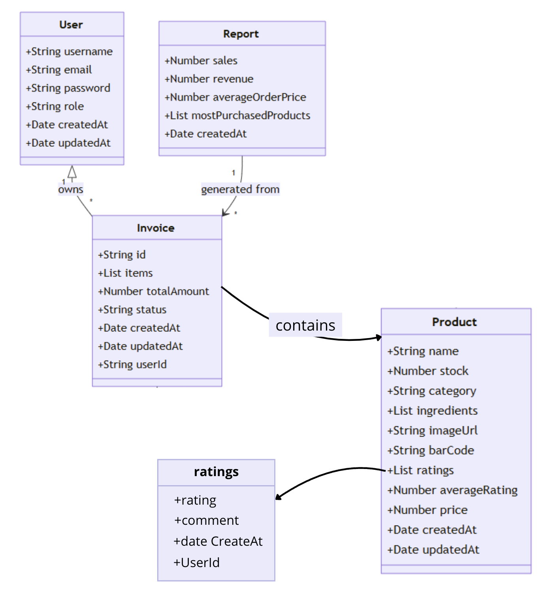

# Frontend

In this repository you'll find:
* The **mobile** application for your customers to download and use to scan products and pay
* The **web** administrator app to manage the users / products / invoices

## Web app

The web app is built with modern web technologies:

- **React 18 + Vite**: Fast and efficient development environment
- **TypeScript**: Type-safe development and better DX
- **Tailwind CSS**: Utility-first styling with dark mode support
- **Radix UI**: Accessible component library for consistent UI
- **Recharts**: Data visualization for sales analytics

The app follows modern React patterns including:
- Component-based architecture
- Custom hooks for business logic
- Context API for state management
- React Router for navigation
- Form validation and error handling

#### *Architecture :*

```sh
    web/
    ├── src/
    │   ├── api/           # API service calls
    │   ├── components/    # Reusable UI components
    │   ├── contexts/      # React contexts
    │   ├── routes/        # Custom hooks
    │   ├── pages/         # Page components
    │   └── utils/         # Helper functions
    ├── public/            # Static assets
    └── README             # This documentation 
```

## Mobile app

The mobile app uses the framework React-Native with Expo

## Features


| Application     | Features                                               |
|----------------|---------------------------------------------------------|
| **Web App**    | - Admin authentication                                  |
|                | - Product management (CRUD)                             |
|                | - Invoice management and tracking                       |
|                | - User management                                       |
|                | - Sales statistics and reporting                        |
|                | - View product ratings and reviews                      |
| **Mobile App** | - Login (auto relog) / Register                         |
|                | - Scan barcodes / Enter manually                        |
|                | - View scanned product details (rating, aliments...)    |
|                | - Pay with PayPal                                       |
|                | - View payment invoice (ticket)                         |
|                | - View invoice history                                  |
|                | - Rate products you bought                              |

## UML




# Data flow

```
    graph TD
        A[Mobile App] --> B[API]
        C[Web Admin] --> B
        B --> D[(MongoDB)]
        B --> E[OpenFoodFacts API]
```

# Backend Stack

### Core Technologies

```
    Node.js
    Express
    MongoDB
    JWT Authentication
    Swagger Documentation
```

# Security Features

    JWT Authentication
    CSRF Protection
    Rate Limiting
    Input Validation
    Secure Headers

# Performance Optimizations

### Frontend

    Code Splitting
    Lazy Loading
    Image Optimization
    Bundle Size Optimization

### Backend 

    Caching
    Database Indexing
    Query Optimization

# Tests

    Frontend: Jest + React Testing Library
    Backend: Mocha + Chai
    E2E: Cypress

# Deploiement

    CI/CD with GitLab
    Docker Containers
    Monitoring and Logs

# Guide d'installation

```sh
    # Frontend install
    cd web
    npm install
    npm run dev

    # Backend install
    cd api
    sudo docker build -t express-api .
    sudo docker compose up --build -d
```

### Configuration .env file

Frontend :
```sh
    # .env example
    VITE_API_URL='http://127.0.0.1:8080/api/'
```
Backend:

```sh
    # .env example
    JWT_SECRET = you_jwt_secret
    DEFAULT_ADMIN_PASSWORD=adminpassword
```

# API Endpoints

| Endpoint | Méthode | Description |
|----------|---------|-------------|
| `/api/auth/register` | POST | Register new user |
| `/api/auth/login` | POST | Login user |
| `/api/auth/login` | GET | Login with token |
| **Products** |
| `/api/products` | GET | Get all products |
| `/api/products` | POST | Create product |
| `/api/products/bought` | GET | Get bought products |
| `/api/products/{barCode}` | GET | Get product by barcode |
| `/api/products/{barCode}` | PUT | Update product |
| `/api/products/{barCode}` | DELETE | Delete product |
| `/api/products/{barCode}/rating` | PUT | Update product rating |
| **Invoices** |
| `/api/invoices` | GET | Get all invoices |
| `/api/invoices` | POST | Create invoice |  
| `/api/invoices/{invoiceId}` | GET | Get invoice by ID |
| `/api/invoices/{invoiceId}` | PUT | Update invoice |
| `/api/invoices/{invoiceId}` | DELETE | Delete invoice |
| **Users** |
| `/api/users/profile` | GET | Get user profile |
| `/api/users/profile` | PUT | Update profile |
| `/api/users/profile` | DELETE | Delete account |
| **Admin** |
| `/api/admin/users` | GET | Get all users |
| `/api/admin/user` | POST | Create user |
| `/api/admin/user/{userId}` | GET | Get user by ID |
| `/api/admin/user/{userId}` | PUT | Update user |
| `/api/admin/user/{userId}` | DELETE | Delete user |
| `/api/admin/invoices` | GET | Get all invoices |
| **Reports** |
| `/api/reports` | GET | Generate report |
| **PayPal** |
| `/api/paypal/create-paypal-order` | POST | Create PayPal order |
| `/api/paypal/get-order-status/{orderId}` | GET | Get order status |
| `/api/paypal/capture-payment/{orderId}` | POST | Capture payment |

# Dépendances majeures

| Package | Version | Usage |
|---------|---------|-------|
| React | 18.x | UI Library |
| Express | 4.x | Backend Framework |
| MongoDB | 5.x | Database |

# Troubleshooting

- Common Issues
  - Authentication errors
  - Database connection issues
  - API rate limiting

- Debug Procedures
  - Check logs in `/var/log/trinity`
  - Monitor MongoDB status
  - Verify JWT token validity

- Error Codes
  - `401`: Unauthorized
  - `403`: Forbidden
  - `404`: Not Found
  - `500`: Server Error
